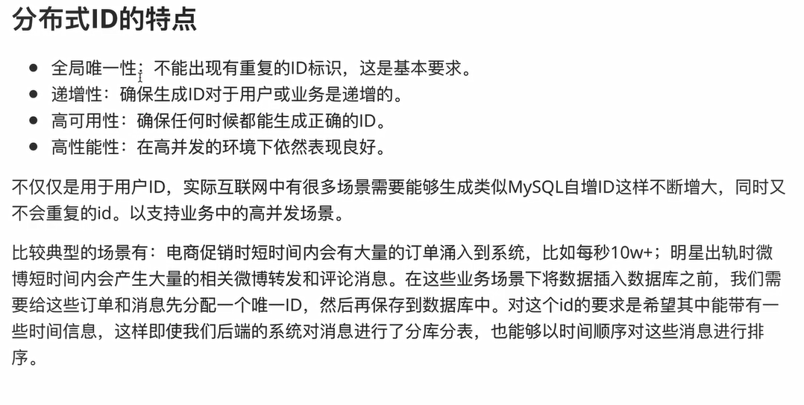
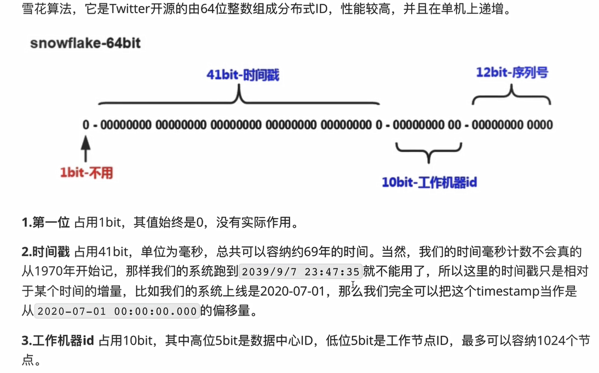
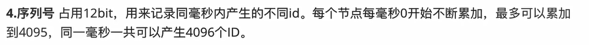
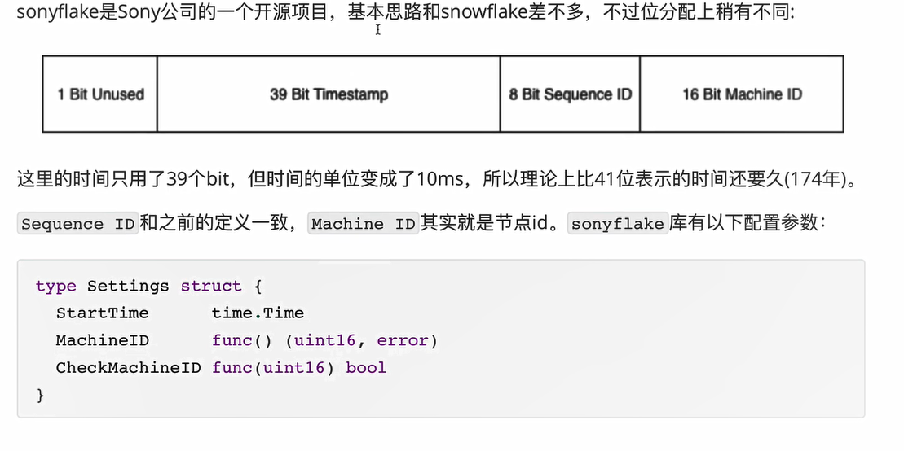

## this project is built for learning

### 分布式ID生成器



### snowflake算法介绍





 同一毫秒 ID 1024 x4096

#### 雪花算法

```
https://github.com/bwmarrin/snowflake
```


#### 雪花算法made by sony

```
https://github.com/sony/sonyflake
```

